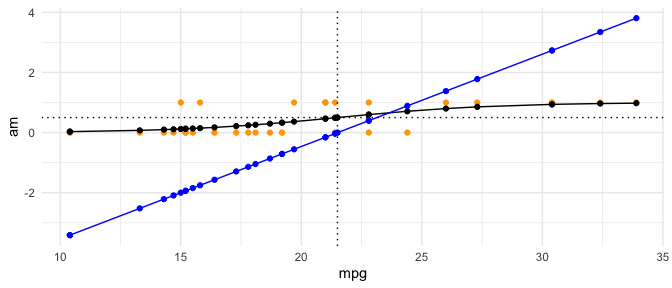
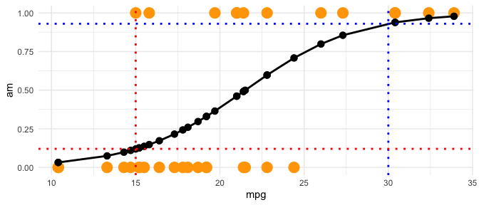
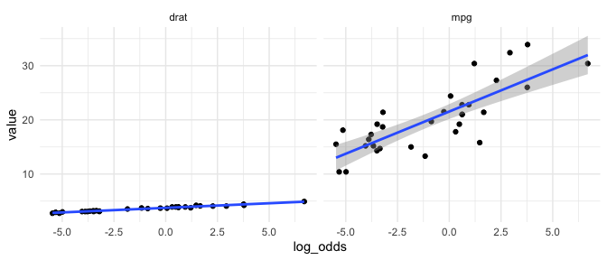
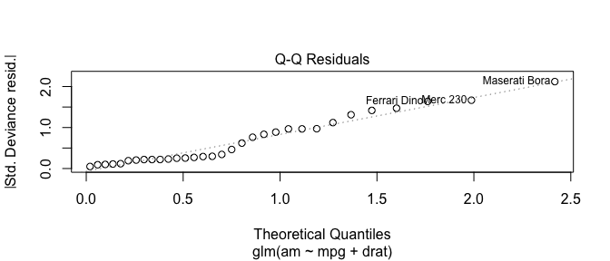
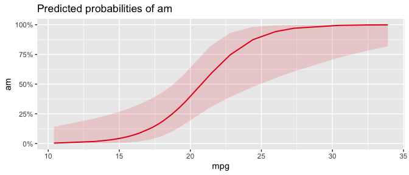

## Sources

-   For Logistic Regression:
    <https://yury-zablotski.netlify.app/post/simple-logistic-regression/>
-   For GLMs and Maximum Likelihood
    <http://web.vu.lt/mif/a.buteikis/wp-content/uploads/PE_Book/5-1-GLM.html>
-   A Course on GLMs
    <https://statmath.wu.ac.at/courses/heather_turner/glmCourse_001.pdf>
-   GLM notes <https://grodri.github.io/glms/notes/c3.pdf>,
    <https://grodri.github.io/glms/notes/a2.pdf>
-   GLM textbook
    <https://www.jstor.org/stable/pdf/2991772.pdf?refreqid=excelsior%3A8635ba4f19e54f467807e4f8bff1bc40&ab_segments=&origin=&initiator=&acceptTC=1>
-   Inference versus prediction
    <https://www.stat.berkeley.edu/~aldous/157/Papers/shmueli.pdf>
-   Algebraic properties of expectations
    <https://www.stat.cmu.edu/~cshalizi/mreg/15/lectures/01/lecture-01.pdf>
-   <https://www.stat.cmu.edu/~cshalizi/uADA/19/lectures/2019-03-07.html>
-   Fisher Scoring (i.e. fitting GLMs) from scratch
    <http://www.jtrive.com/estimating-logistic-regression-coefficents-from-scratch-r-version.html>

# Logistic Regression Basics

Logistic Regression is used for modeling data with a categorical
response.

Logistic regression predicts the probability of success.

We use it when using OLS is inappropriate because the data the outcome
variable is binary.

$$\text{response} \Leftrightarrow \text{log(odds)} \Leftrightarrow \log\bigr(\frac{p}{1-p}\bigl) = \beta_0 + \beta_1X_1+\dots +\beta_k X_k $$

## A Primer/Refresher on Probability, Odds, Odds Ratios

Probability = something happening / (something happening + something not
happening)

Odds = something happening / something not happening

Log(Odds) = Log(something happening / something not happening)

Log(Odds) = log(p / (1-p)) = logit!

Odds ratio = odds of one thing / odds of another thing (e.g., 4/3 /
15/20 )

-   If event 1 has a p probability of success and event 2 has a q
    probability of success then the odds ratio is
    $\frac{\frac{p}{1-p}}{\frac{q}{1-q}}$. The odds-ratio tells us how
    many times are one odds differ from the other. Note that you can't
    directly translate odds ratios to probability without knowing the
    probability of one of the events!

In summary, probability is bounded between 0 and 1. Odds can take any
value between 0 and $\infty$, with 1 in the "middle" splitting all the
possible odds into two segments. A small segment of odds, from 0 to 1,
shows higher probability of failure then of success. And an (literally)
infinite segment of odds, from 1 to $\infty$, shows higher probability
of success then of failure. Such asymmetry is very odd and difficult to
interpret. That is why we need the logarithm of odds. Log odds goes from
$-\infty$ to $\infty$.

Suppose an event has a probability of 50% of happening. So p = 1/2. Then
the odds are 1/2 / 1/2 = 1/1 or 1:1. The log odds are log(1/1) = 0.
Think of these values as the middles.

If the probability is greater than 50%, then the odds are greater than
1, and the log odds are greater than 0.  

### Converting To Probability

$$\text{Odds} = p / (1-p)$$

$$p = \text{Odds} / (1 + \text{Odds} )  $$
$$\text{logit = log(odds) = log}(\frac{p}{1-p})$$ So, to convert from
log odds to probability, we use the following formula:

$$p = \frac{e^{\text{log odds}}}{1 + e^{\text{log odds}}}$$

#### Example

Suppose we have odds of 20:1. 20:1 odds mean for every 20 successes
you'll get 1 failure.

What is the probability of success?

The probability of success is odds/(1 + odds) $\rightarrow$
(20/1)/(1+20/1) = 20/21 = 0.95

Suppose we have log odds of 1.609438 (i.e. log(5)).

What is the probability of success?

exp(1.609438) / (1 + exp(1.609438)) =
0.83

#### Summary of Log-Odds

Logistic regression uses log odds because they are:

1.  Symmetric, as compared to odds

2.  Centered around zero as compared to odds or probabilities, which
    makes their sign (+/-) interpretable

3.  Linear and infinite, as compared to probabilities, which is highly
    non-linear and is constrained between 0 and 1

4.  Can be easily transformed to odds or probabilities which are easier
    to understand

# Logit model

Logistic regression uses a logit $\log(\frac{p}{1-p})$ to model a linear
combination of predictors, which produces a straight line of log(odds).
(That is, like linear regression, logistic regression fits a straight
line/plane/hyperplane - called a decision boundary in machine learning).
This line maximizes the likelihood of the coefficients given the data.

How do we do this?

1.  We start with the following model:
    $y/\text{response} \rightarrow \text{Log}(\text{odds}) = \text{Log}(\frac{p}{1-p}) = \beta_0 + \beta_1 X_1$
    where
    $p = \frac{e^{X\beta}}{1+e^{X\beta}} = \frac{1}{1+e^{-X\beta}}$

2.  In the bivariate case (i.e. one response and one predictor), these
    probabilities are the likelihoods of the observed predictor-values
    (i.e. X's) after their projection from the x-axis onto the log(odds)
    and then onto the s-curve.

-   Why log odds? "The probabilities can be expressed in the form of
    lod-odds. We need log-odds because they are linear instead of
    s-curvy (and our estimation procedure - glm - doesn't estimate
    curves). Thus, since the probability is just a transformation of the
    log-odds, we could build a linear model (with intercept and slope)
    around the log-odds, and then re-express log-odds in terms of
    probabilities if needed."

The log-odds line does a great job in modelling the outcome/y. However,
it's hard to directly interpret (i.e. what does a log odds of 0.5 mean
to you?). This is why we need predicted probabilites to interpret the
results! - If the log odds = 0.5, we can convert that to probabilities
in the following way: Suppose log(p/(1-p)) = 0.5. Then p = exp(0.5) /
(1 + exp(0.5)) = 62 percentage points. This is intuitive!

In sum, a straight lod-odds line is making a good job in modelling the
outcome variable, while it does a bad job in explaining what does a
particular predictor value means for the outcome. So, to make it
interpretable, we transform the log odds into probabilities. Since we
can't model the probability directly we need the lod-odds for modelling,
and probabilities for reporting the results.

(Note \`\`Likelihood is the hypothetical probability that an event that
has already occurred would yield a specific outcome. The concept differs
from that of a probability in that a probability refers to the
occurrence of future events, while a likelihood refers to past events
with known outcomes." <https://mathworld.wolfram.com/Likelihood.html>. A
likelihood function L(a) is the probability or probability density for
the occurrence of a sample configuration $x_1, ..., x_n$ given that the
probability density f(x;a) with parameter a is known,
$L(a)=f(x_1;a)...f(x_n;a)$ )

See: -
<https://yury-zablotski.netlify.app/post/how-logistic-regression-works/>

### Show the difference between log odds and probability

``` r
#https://bookdown.org/pdr_higgins/rmrwr/logistic-regression-and-broom-for-tidying-models.html
#performance::check_model(m, panel = F)

# add predictions to the original data
# visualize log-odds and probabilities to see their connection

m <- glm(formula = am ~ mpg, data = mtcars, family = binomial())

# add predictions to the original data
mtcars <- mtcars %>% 
  mutate(log_odds = predict(m),
         # below you also could have used plogis(predict(m))
         # if we use predict(m) without specifying type, we get logit (log(p/(1-p)))
         preds_prob = predict(m, type = "response"),
         odds = preds_prob / (1-preds_prob))

# visualize log-odds and probabilities to see their connection
ggplot(mtcars)+
  geom_point(aes(mpg, am), color = "orange")+
  geom_point(aes(mpg, preds_prob))+
  geom_line(aes(mpg, preds_prob))+
  geom_point(aes(mpg, log_odds), color = "blue")+
  geom_line(aes(mpg, log_odds), color = "blue")+
  # geom_point(aes(mpg, odds), color = "darkgreen")+
  # geom_line(aes(mpg, odds), color = "darkgreen")+

  geom_vline(xintercept = 21.5, linetype = "dotted")+
  geom_hline(yintercept = 0.5, linetype = "dotted")+
  theme_minimal()

#performance::check_model(m)
```



The plot above provides a good explanation of what's going on. We start
with the orange dots -- these are the original (x,y) pairs. Notice how
all of the dots are in the same x space - the entire point of this plot
(and of logistic regression), is translating those orange dots - the
original y's or 0/1's - into probabilities via logistic odds. We do that
in two steps - first we turn the orange dots into log(odds) using a
generalized linear model (i.e we project them onto the blue line). Then
we take those log odds and transform them into predicted probabilities.

In sum:

-   The orange dots are the original data -- the (x,y) pairs  
-   The blue line is a transformation of the dots into log odds from the
    logit model  
-   The black line are the predicted probabilities from the logit model
    (i.e. $\frac{e^{\text{log odds}}}{1 + e^{\text{log odds}}}$)

Zooming in what we want, for $\hat{y}$ and $\hat{\beta}$ tasks, is the
S-curve. The interpretation is as easy as this: if the car has an mpg of
30 there is a 93% probability (dotted blue lines), that it has a manual
transmission, while low mpg, of let's say 15 (dotted red lines), shows
only 12% probability of this car to have a manual transmission.

``` r
ggplot(mtcars)+
  geom_point(aes(mpg, am), color = "orange", size = 5)+
  geom_point(aes(mpg, preds_prob), size = 3)+
  geom_line(aes(mpg, preds_prob), size = 1)+
  geom_hline(yintercept = 0.93, linetype = "dotted", color = "blue", size = 1)+
  geom_vline(xintercept = 30, linetype = "dotted", color = "blue", size = 1)+
  geom_hline(yintercept = 0.12, linetype = "dotted", color = "red", size = 1)+
  geom_vline(xintercept = 15, linetype = "dotted", color = "red", size = 1)+
  theme_minimal()
```



## Logit Assumptions/What Happens When Violated/How to Check

What do we need to assume to use a logit model?

1.  No dependent observations. "The assumption that the response
    variables $y_1, . . . , y_n$ are independent is, however, too
    strong. In many applications, these variables are observed on nodes
    of a network, or some spatial or temporal domain, and are dependent.
    Examples abound in financial and meteorological applications, and
    dependencies naturally arise in social networks through peer
    effects, whose study has recently exploded in topics as diverse as
    criminal activity (see e.g. \[24\]), welfare participation (see e.g.
    \[2\]), school achievement (see e.g. \[36\]), participation in
    retirement plans \[18\], and obesity (see e.g. \[39, 11\]).

(Consequences) If this is violated then $E(Y_{ij} | X_i)$ won't be
correct - so you're not estimating a population mean! If violated,
GLMM - generalized linear mixed effect models should be applied.

See: -
<https://faculty.washington.edu/heagerty/Courses/b571/handouts/LM-WLS+EDA.pdf>  
- <https://yury-zablotski.netlify.app/post/mixed-effects-models-4/>  
- <http://people.csail.mit.edu/costis/dependent-regression.pdf>

(Checking) No formal test that I can find. So you have to think about
the data!

(What to do) GLMM or this procedure
<http://people.csail.mit.edu/costis/dependent-regression.pdf>

1.  No multicollinearity among predictors.

(Consequences) The betas aren't interpretable. This is a problem for
explaining - not for prediction. $\beta_1$ and $\beta_2$ could be 10 and
0, or 5 and 5, or 7 and 3, since that would yield the same result p
(which is $\frac{1}{1+e^{logit}}$, and therefore the same error. That is
why you generally do not want to use data that is multicollinear.
Therefore you could call a model that does not have collinearity a
'better' model.

On the other hand, when we're focused on predicting the 'p' as we would
be for machine learning/predictive modeling, it does not matter that we
can't interpret the betas. What matters is that 'p' is as close to the
true 'p' as possible.

See: -
<https://stats.stackexchange.com/questions/169943/why-can-multicollinearity-be-a-problem-for-logistic-regression>  
- <https://www.stat.berkeley.edu/~aldous/157/Papers/shmueli.pdf>

(Checking) This can be checked with Variation Inflation Factor (VIF). If
VIF of any variable is above 5, be concerned and find out which two
variables have similar information.

1.  No influential values (extreme values or outliers) in the continuous
    predictors.

(Consequences) The betas are incorrect/distorted

(Checking) This can be assessed by converting the continuous predictors
to standardized scores, and removing values below -3.29 or greater than
3.29.

See: -
<https://us.sagepub.com/sites/default/files/upm-assets/17840_book_item_17840.pdf>

1.  Linear relationship between continuous predictor variables and the
    logit of the outcome

(Consequences) The model describes your data poorly. You can have non
linear variables but they must be transformed so as to be linearly
related to your outcome.

(Checking) This can be checked using two plots - one making sure the
predictors are linear and looking at a QQ plot of the residuals because
\`\`an interesting property of Standardized Pearson Residuals is that
they have an approximate Standard Normal distribution if the model fits
(Agresti, 2002)"

``` r
m <- glm(am~mpg+drat, mtcars, family = binomial())

# linear in the predictors
mtcars %>% 
  dplyr::select(mpg, drat) %>% 
  mutate(log_odds = predict(m)) %>% 
  pivot_longer(-log_odds) %>% 
  ggplot(aes(log_odds, value))+
  geom_point()+
  geom_smooth(method = lm)+
  facet_wrap(~name)+
  theme_minimal()

# QQ plot 
plot(m, which = 2)
```





See:

-   <https://www.lexjansen.com/scsug/2018/Shreiber-Gregory-SCSUG2018-Assumption-Violations.pdf>  
-   <https://faculty.washington.edu/heagerty/Courses/b571/handouts/LM-WLS+EDA.pdf>  
-   <https://stats.stackexchange.com/questions/32285/assumptions-of-generalised-linear-model>

# Generalized Linear Models (GLMs)

Logits are a type of generalized linear models (GLMs). Generalized
linear models (GLMs) (McCullagh and Nelder 1989) extend the linear
regression model so as to accommodate binary and count dependent
variables.

In a Generalized Linear Model, the response may have any distribution
from the exponential family, and rather than assuming the mean is a
linear function of the explnatory variables, we assume that a function
of the mean, or the link function, is a linear function of the
explnatory variables.
<http://www.jtrive.com/estimating-logistic-regression-coefficents-from-scratch-r-version.html>

Maximum likelihood is asymptotically efficient, meaning that its
parameter estimates converge on the truth as quickly as possible
<https://www.stat.cmu.edu/~cshalizi/mreg/15/lectures/06/lecture-06.pdf>

An important practical feature of generalized linear models is that they
can all be fit to data using the same algorithm, a form of iteratively
re-weighted least squares.

There are three components to a GLM:

**Random Component** -- refers to the probability distribution of the
response variable (Y); e.g. binomial distribution for Y in the binary
logistic regression.

**Systematic Component** -- refers to the explanatory variables
$(X_1, X_2, ... X_k)$ as a combination of linear predictors - e.g.
$\beta_0 + \beta_1x1 + \beta_2x2$

**Link Function**, $\eta$ or $g(\mu)$ -- The link function relates the
linear predictor to some parameter ($\theta$) of the distribution for Y
(usually the mean). Let $g(·)$ be the link function and let
$E(Y) = \theta$ be the mean of distribution for $Y$.

The link function specifies the link between random and systematic
components. It says how the expected value of the response relates to
the linear predictor of explanatory variables; e.g.
$\eta = \text{logit}(p)$ for logistic regression. I.e. it transforms the
dependent variable into a linear combination of the independent
variables.

### How to Get Coefficients and Errors for a GLM

1.  Specify a distribution for Y. I.e. assume our data was generated
    from some distribution:
    -   Continuous and Unbounded: Normal  
    -   Binary: Bernoulli  
    -   Event Count: Poisson  
    -   Duration: Exponential  
    -   Ordered Categories: Normal with observation mechanism
    -   Unordered Categories: Multinomial
2.  Specify a linear predictor
    -   We are interested in allowing some parameter of the distribution
        $\theta$ to vary as a (linear) function of covariates. So we
        specify a linear predictor.
    -   i.e. $X\beta = \beta_0 + x_1\beta_1+x_2\beta_2+\dots+x_n\beta_n$
3.  Specify a link function
    -   The link function relates the linear predictor to some parameter
        $\theta$ of the distribution for Y (usually the mean).
    -   $g(\theta)=X\beta$
    -   $\theta = g^{-1}(X\beta)$
    -   Together with the linear predictor this forms the systematic
        component
    -   For logistic regression the link is
        $\ln\frac{\pi}{1-\pi}=X\beta$
        -   This means the inverse link is
            $\pi = \frac{1}{1+e^{-X\beta}}$
4.  Estimate Parameters via Maximum Likelihood
    -   We do this in three steps:
        1.  Writing down the likelihood  
        2.  Estimating the parameters by maximizing the likelihood  
        3.  Getting an estimate of the variance by inverting the
            negative Hessian
5.  Simulate or Calculate Quantities of Interest

Source:
<https://bstewart.scholar.princeton.edu/sites/g/files/toruqf4016/files/bstewart/files/lecture4_glm_slides.pdf>

### Example: Logit

Binary Logistic regression models how the odds of "success" for a binary
response variable Y depend on a set of explanatory variables:
$\text{logit}(p) = \text{log}(\frac{p}{1-p})=\beta_0 + \beta_1 x_i$

1.  Specify a distribution for Y. I.e. specify the stochastic/random
    component. The distribution of the response variable is assumed to
    be binomial with a single trial and success probability p

    1.  $Y_i \sim \text{Bernoulli}(y_i|\pi_i) = \pi^{y_i}(1-\pi_i)^{1-y_i}$
    2.  The above implies that $Y_i = \pi_i$ for y = 1 and $1-\pi_i$ for
        y = 0

2.  Specify a linear predictor / systematic component. Here we note that
    the explanatory variable (can be continuous, discrete, or both) is
    linear in the parameters $\beta_0 + \beta x_i$

    1.  $X_i\beta$

3.  Specify a link function

    1.  $Pr(Y_i = 1|\beta) \equiv E(Y_i) \equiv \pi_i = \frac{1}{1 + e^{-x_i\beta}}$
    2.  We're assuming $Y_i$ and $Y_j$ are independent conditional on X.
    3.  We can use different link functions - for example, for probit
        it's $\Phi(X\beta)$ -- the CDF of the standard normal
        distribution

4.  Derive maximum likelihood estimate for $\beta$
    $$l(\beta|Y) = \log L(\beta|Y_i)$$ $$= \log p(Y_i|\beta)$$
    $$= \log \prod_{i=1}^n \underbrace{p(Y_i|\beta)}_{\text{Replace with dist. of Y - bernoilli for binary}}$$
    $$= \log \prod_{i=1}^n \underbrace{\pi_i^{y_i}(1-\pi_i)^{1-y_i}}_{\text{Replace }\pi_i \text{ with link function}}$$
    $$= \log \prod_{i=1}^n \underbrace{\frac{1}{1 + e^{-x_i\beta}}^{y_i}(1-\frac{1}{1 + e^{-x_i\beta}})^{1-y_i}}_{\text{Now use log rules to simplify}}$$

    $$ = \sum_{i=1}^n y_i \log (\frac{1}{1 + e^{-x_i\beta}}) + (1-y_i) \log (1-\frac{1}{1 + e^{-x_i\beta}})$$
    $$ = \sum_{i=1}^n -y_i \log ({1 + e^{-x_i\beta}}) + (1-y_i) \log (1-\frac{1}{1 + e^{-x_i\beta}})$$
    $$ = - \sum_{i=1}^n \log (1+ e^{(1-2y_i)x_i\beta})$$

The above cannot be maximized analytically (i.e. by taking the
derivative with respect to $\beta$, setting the equation to 0, and
solving). So we use a numeric approximation - in R it's Fischer scoring.

### Example: OLS with canonical link

Note, this is just regular OLS!

1.  Specify a distribution for Y. I.e. specify the sthocastic/random
    component. The distribution of the response variable is assumed to
    be binomial with a single trial and success probability p
    1.  $Y_i \sim \text{N}(X\beta, \sigma^2)= \frac{1}{\sigma(2\pi)^{1/2}}\text{exp}(\frac{y_i-\mu}{2\sigma^2})$
2.  Specify a linear predictor / systematic component. Here we note that
    the explanatory variable (can be continuous, discrete, or both) is
    linear in the parameters $\beta_0 + \beta x_i$
    1.  $\beta'X$
3.  Specify a link function
    1.  identity link $\mu = \beta'X$
    2.  Note we're going to replace the $\mu$ in 1 above with $X\beta$
4.  Derive maximum likelihood estimate for $\beta$

Likelihood
$L = \prod_{i=1}^{n} = \frac{1}{\sigma\sqrt{2\pi}}\text{exp}(\frac{y_i-\mu}{2\sigma^2})$

Now replace $\mu$ with $\beta'X$
$$L = \prod_{i=1}^{n} \frac{1}{\sigma\sqrt{2\pi}}\text{exp}(\frac{(y_i-\beta'x_i)^2}{2\sigma^2}) $$
Take logs
$$\log(L) = \sum_{i=1}^{n} \log(\frac{1}{\sigma\sqrt{2\pi}}) + \log(\text{exp}(\frac{(y_i-\beta'x_i)^2}{2\sigma^2})) $$
Use log rules to simplify

$$\log(L) = \sum_{i=1}^{n} -\log(-\sigma\sqrt{2\pi}) + (\frac{(y_i-\beta'x_i)^2}{2\sigma^2}) $$
Now we want to find $\beta$, let's make this easier by replacing
$\sum (y_i-\beta'x_i)^2$ with $(Y-X\beta)'(Y-X\beta)$

$$\log(L) = -n\log(-\sigma\sqrt{2\pi}) + \frac{1}{2\sigma^2}\times(Y-X\beta)'(Y-X\beta) $$
Now we can take the partial with respect to it, set it equal to 0, and
solve

$$\frac{\partial l}{\partial \beta} = \frac{1}{2\sigma^2} \times (-2 X'Y + 2 \beta X'X) = 0$$
Now, solve like normal $$\beta = (X'X)^{-1}X'Y$$

### Example: Probit

1.  Specify a distribution for Y. I.e. specify the stochastic/random
    component. The distribution of the response variable is assumed to
    be binomial with a single trial and success probability p
    1.  $Y_i \sim \text{Bernoulli}(y_i|\pi_i) = \pi^{y_i}(1-\pi_i)^{1-y_i}$
    2.  The above implies that $Y_i = \pi_i$ for y = 1 and $1-\pi_i$ for
        y = 0
2.  Specify a linear predictor / systematic component. Here we note that
    the explanatory variable (can be continuous, discrete, or both) is
    linear in the parameters $\beta_0 + \beta x_i$
    1.  $X_i\beta$
3.  Specify a link function
    1.  $Pr(Y_i = 1|\beta) \equiv E(Y_i) \equiv \pi_i = \Phi(X\beta)$ --
        the CDF of the standard normal distribution
    2.  We're assuming $Y_i$ and $Y_j$ are independent conditional on X.
4.  Derive maximum likelihood estimate for $\beta$

$$L = \pi^{y_i}(1 - \pi)^{1-y_i} $$
$$\log(L) = \sum\Phi(X\beta)^{y_i}(1-\Phi(X\beta))^{1-y_i} $$ For just
optim, we can stop here
$$\log(L) = \sum y_i \log \Phi(X\beta) + (1-y_i) \log (1-\Phi(X\beta)) $$

### Coding Probit, Logit

``` r
# get link functions for ols, logit, probit
ll.logit <- function(beta,y=y, X=X){
  logl <- -1 * sum(log(1 + exp((1-2*y)*X%*%beta)))
  return(logl)
}


ll.probit <- function(beta, y=y, X=X){
  phi <- pnorm(X%*%beta, log = TRUE)
  opp.phi <- pnorm(X%*%beta, log = TRUE, lower.tail = FALSE)
  logl <- sum(y*phi + (1-y)*opp.phi)
  return(logl)
}


X <- model.matrix(~ mpg + wt, data = mtcars)
opt.logit <- optim(par = rep(0, ncol(X)), fn = ll.logit, X = X, y = mtcars$am, control = list(fnscale = -1), hessian = T, method = "BFGS")
opt.probit <- optim(par = rep(0, ncol(X)), fn = ll.probit, X = X, y = mtcars$am, control = list(fnscale = -1), hessian = T, method = "BFGS")

glm(formula = am ~ mpg + wt, data = mtcars, family = binomial(link = "probit"))
```


    Call:  glm(formula = am ~ mpg + wt, family = binomial(link = "probit"), 
        data = mtcars)

    Coefficients:
    (Intercept)          mpg           wt  
        13.5226      -0.1649      -3.4088  

    Degrees of Freedom: 31 Total (i.e. Null);  29 Residual
    Null Deviance:      43.23 
    Residual Deviance: 17.46    AIC: 23.46

``` r
glm(formula = am ~ mpg + wt, data = mtcars, family = binomial(link = "logit"))
```


    Call:  glm(formula = am ~ mpg + wt, family = binomial(link = "logit"), 
        data = mtcars)

    Coefficients:
    (Intercept)          mpg           wt  
        25.8866      -0.3242      -6.4162  

    Degrees of Freedom: 31 Total (i.e. Null);  29 Residual
    Null Deviance:      43.23 
    Residual Deviance: 17.18    AIC: 23.18

### Comparing LPM, Probit, Logit

So how do a linear probability model, logit and probit compare? See the
following illustration where the lpm is in green, the logit is in blue,
and the probit is in orange.

``` r
library(latex2exp)
#simulate data - start with random x
# see https://data.library.virginia.edu/simulating-a-logistic-regression-model/
x1 <- rnorm(1000, 0, 2)

# now make the "true" model
xb <- 2 + 5 * x1

# convert to probability, so we can simulate probabilities in the next step and have them be related to the betas
p <- 1/(1+ exp(-xb))

# now draw 0/1's based on the data above 
y <- rbinom(n = 1000, size = 1, prob = p)

sim_data <- tibble(
  y = y,
  x1 = x1
)

# run the models
logit_ex <- glm(y ~ x1, data = sim_data, family = binomial(link = "logit"))
probit_ex <- glm(y ~ x1, data = sim_data, family = binomial(link = "probit"))
lpm_ex <- lm(y~x1, data = sim_data)

sim_data %<>%
  mutate(
    logit_preds_prob = predict(logit_ex, type = "response"),
    probit_preds_prob = predict(probit_ex, type = "response"),
  )

# now plot all
ggplot(sim_data, aes(x = x1, y = y)) + 
  geom_point() + 
  # add lpm
  geom_abline(slope = lpm_ex$coefficients[2], intercept = lpm_ex$coefficients[1], color = "darkgreen") + 
  geom_line(aes(x = x1, y = logit_preds_prob), color = "blue")+
  geom_line(aes(x = x1, y = probit_preds_prob), color = "orange") + 
  annotate(geom="text", x=3, y=0.45, label = c(paste("Beta hat LPM:", round(lpm_ex$coefficients[2],2))), color="darkgreen") +
  annotate(geom="text", x=3, y=0.30, label = c(paste("Beta hat Logit:", round(logit_ex$coefficients[2],2))), color="blue") +
  annotate(geom="text", x=3, y=0.15, label=c(paste("Beta hat Probit:", round(probit_ex$coefficients[2],2))), color="orange") + theme_minimal()
```


What do we get from the above?  

-   LPM goes outside of \[0, 1\] for extreme values of $X_i$
-   LPM underestimates the marginal effect near center and overpredicts
    near extremes
-   Logit has slightly fatter tails than probit, but no practical
    difference
-   Note that $\hat{\beta}$ are completely different between the models

### GLM properties

1.  It's the minimum variance unbiased estimator (MVUE)
2.  Invariance to reparameterization
    -   You can estimate $\sigma$ with $\hat{\sigma}$ and calculate
        $\hat{\sigma^2}$ or estimate $\hat{\sigma^2}$ and both are
        Maximum Likelihood Estimates
3.  Invariance to sampling plans

### Asymptotic GLM properties

1.  Consistency (from the Law of Large Numbers). As
    $n \rightarrow \infty$, the sampling distribution of the MLE
    collapses to a spike over the parameter value
2.  Asymptotic normality
    -   as $n \rightarrow \infty$ the distribution of MLE / se(MLE)
        converges to a Normal
3.  Asymptotic efficiency (i.e. minimum asymptotic variance)

See
<https://bstewart.scholar.princeton.edu/sites/g/files/toruqf4016/files/bstewart/files/lecture3_inference_slides.pdf>

### Maximum Likelihood/Getting to the Logit Model

Why use it? There is no analytical solution to solve for the
coefficients in a logit model.

#### Logarithm Review

-   log(A × B) = log(A) + log(B)
-   log(A/B) = log(A) − log(B)
-   log(Ab) = b × log(A)
-   log(e) = ln(e) = 1
-   log(1) = 0

How do we get to that point?

1.  We can model $Y_i$ via a generalized linear model with a link
    function. (NOTE: THE LINK FUNCTION IS CRITICAL!) I.e.
    $$g(E[Y_i|X_i])=g(u_i)=X_i\beta = \beta_0 + \beta_1 X_{1i} ... $$

This means that the conditional mean is
$$E[Y|X] = 1 \times p E[Y=1|X_i] +0 \times p E[Y=0|X_i]= 1 \times p E[Y=1|X_i] = p_i$$
Remember, we're dealing with expectations, so we're dealing with a
population.

In order to estimate the probability from our sample, we want to find
the link function for $p_i=\mu_i$

To do this, we notice the following:

Start with $L(\beta|Y=y,X=x) = \prod_{i=1}^n P(Y_i = y_i|X=x_i, \beta)$

1.  We're going to assume the $Y_i$ as a Bernoulli random variable

<https://mathworld.wolfram.com/MaximumLikelihood.html>
<https://www.stat.cmu.edu/~cshalizi/uADA/12/lectures/ch12.pdf>

## Fisher Scoring - Iteratively Solving for Parameters

``` r
getCoefficients <- function(design_matrix, response_vector, epsilon=.0001) {
    # =========================================================================
    # design_matrix      `X`     => n-by-(p+1)                                |
    # response_vector    `y`     => n-by-1                                    |
    # probability_vector `p`     => n-by-1                                    |
    # weights_matrix     `W`     => n-by-n                                    |
    # epsilon                    => threshold above which iteration continues |
    # =========================================================================
    # n                          => # of observations                         |
    # (p + 1)                    => # of parameterss, +1 for intercept term   |
    # =========================================================================
    # U => First derivative of Log-Likelihood with respect to                 |
    #      each beta_i, i.e. `Score Function`: X_transpose * (y - p)          |
    #                                                                         |
    # I => Second derivative of Log-Likelihood with respect to                |
    #      each beta_i. The `Information Matrix`: (X_transpose * W * X)       |
    #                                                                         |
    # X^T*W*X results in a (p+1)-by-(p+1) matrix                              |
    # X^T(y - p) results in a (p+1)-by-1 matrix                               |
    # (X^T*W*X)^-1 * X^T(y - p) results in a (p+1)-by-1 matrix                |
    # ========================================================================|
    X <- as.matrix(design_matrix)
    y <- as.matrix(response_vector)

    # initialize logistic function used for Scoring calculations =>
    # this is the probability at point v on the s-curve 
    pi_i <- function(v) return(exp(v)/(1 + exp(v)))

    # initialize beta_0, p_0, W_0, I_0 & U_0 =>
    beta_0 <- matrix(rep(0, ncol(X)), nrow=ncol(X), ncol=1, byrow=FALSE, dimnames=NULL)
    # initialize probability (at 1/2 - because all the x's are at zero and epx(0)/(1+exp(0))=0.5)
    p_0    <- pi_i(X %*% beta_0)
    # here diag() turns a vector into a matrix where only the diagonals have a value
    W_0    <- diag(as.vector(p_0*(1-p_0)))
    # information matrix used in fischer scoring
    I_0    <- t(X) %*% W_0 %*% X
    # U is the vector of first-order partial derivatives of the Log-Likelihood function
    U_0    <- t(X) %*% (y - p_0)

    # initialize variables for iteration =>
    beta_old                   <- beta_0
    iter_I                     <- I_0
    iter_U                     <- U_0
    iter_p                     <- p_0
    iter_W                     <- W_0
    fisher_scoring_iterations  <- 0

    # iterate until difference between abs(beta_new - beta_old) < epsilon =>
    while(TRUE) {

        # Fisher Scoring Update Step =>
        fisher_scoring_iterations <- fisher_scoring_iterations + 1
        beta_new <- beta_old + solve(iter_I) %*% iter_U

        if (all(abs(beta_new - beta_old) < epsilon)) {
            model_parameters  <- beta_new
            fitted_values     <- pi_i(X %*% model_parameters)
            covariance_matrix <- solve(iter_I)
            break

        } else {
            iter_p   <- pi_i(X %*% beta_new)
            iter_W   <- diag(as.vector(iter_p*(1-iter_p)))
            iter_I   <- t(X) %*% iter_W %*% X
            iter_U   <- t(X) %*% (y - iter_p)
            beta_old <- beta_new
        }
    }

    summaryList <- list(
        'model_parameters'=model_parameters,
        'covariance_matrix'=covariance_matrix,
        'fitted_values'=fitted_values,
        'number_iterations'=fisher_scoring_iterations
    )
    return(summaryList)
}

getCoefficients(design_matrix = cbind(1, mtcars[,c("mpg","cyl")]), response_vector =  mtcars[,c("am")], epsilon = 0.00001)
```

    $model_parameters
              [,1]
    1   -8.7620273
    mpg  0.3650051
    cyl  0.1656727

    $covariance_matrix
                1         mpg         cyl
    1   47.497321 -1.41755844 -3.13983099
    mpg -1.417558  0.04512941  0.08539374
    cyl -3.139831  0.08539374  0.23730853

    $fitted_values
                              [,1]
    Mazda RX4           0.47430139
    Mazda RX4 Wag       0.47430139
    Datsun 710          0.55546547
    Hornet 4 Drive      0.51077756
    Hornet Sportabout   0.35181939
    Valiant             0.23841303
    Duster 360          0.09822771
    Merc 240D           0.69142437
    Merc 230            0.55546547
    Merc 280            0.31866923
    Merc 280C           0.21910300
    Merc 450SE          0.18991492
    Merc 450SL          0.24562965
    Merc 450SLC         0.13140770
    Cadillac Fleetwood  0.02556600
    Lincoln Continental 0.02556600
    Chrysler Imperial   0.11194046
    Fiat 128            0.97649663
    Honda Civic         0.95243013
    Toyota Corolla      0.98626984
    Toyota Corona       0.43739825
    Dodge Challenger    0.14441830
    AMC Javelin         0.13140770
    Camaro Z28          0.07030074
    Pontiac Firebird    0.39447289
    Fiat X1-9           0.86591368
    Porsche 914-2       0.80071911
    Lotus Europa        0.95243013
    Ford Pantera L      0.15848203
    Ferrari Dino        0.35953299
    Maserati Bora       0.12329722
    Volvo 142E          0.42843764

    $number_iterations
    [1] 6

``` r
glm(formula = am ~ mpg + cyl, data = mtcars, family = binomial())
```


    Call:  glm(formula = am ~ mpg + cyl, family = binomial(), data = mtcars)

    Coefficients:
    (Intercept)          mpg          cyl  
        -8.7620       0.3650       0.1657  

    Degrees of Freedom: 31 Total (i.e. Null);  29 Residual
    Null Deviance:      43.23 
    Residual Deviance: 29.56    AIC: 35.56

# Model Diagnistics

We have a model and now we need to evaluate it.

See:

\-
<https://bstewart.scholar.princeton.edu/sites/g/files/toruqf4016/files/bstewart/files/lecture4_glm_slides.pdf>  
-
<https://bookdown.org/ltupper/340f21_notes/deviance-and-residuals.html>

Response residuals are handy if you want to explain a particular data
point to someone who's not statistically trained, since they're on a
more intuitive scale.

Pearson residuals (and other standardized residuals) are helpful for
trying to see if a point is really unusual, since they're scaled, like
z-scores.

Deviance residuals make a lot of sense if you want to be consistent
about the math you're using -- they are based on likelihood, and in
GLMs, your model fitting is also based on maximum likelihood.

The AIC is a measure of fit that penalizes for the number of parameters
p AIC = −2lmod + 2p Smaller values indicate better fit and thus the AIC
can be used to compare models (not necessarily nested).

# Logit Model Interpretation

The coefficients cannot be interpreted like OLS coefficients. Because a
one unit increase in an independent variable is a $\beta$ unit increase
in the log odds, interpreting the coefficients as is isn't a useful
exercise. In general we have three options:

1.  Interpret in percentage terms
2.  Simulate predicted probabilities
3.  Interpret in probability terms

The first two options are the most useful. The easiest is the percentage
interpretation.

1.  Suppose we had a coefficient of 0.156. We'd interpret that as
    $\exp(.1563404) = 1.1692241$ means that a one unit increase in x
    increased the odds of y by 17%.

2.  We can simulate predicted probabilities - essentially what we do is
    keep the other variables at their means and then simulate the
    probabilities when a continuous variable is at various values.
    Here's a toy example where we're predicting whether a car has a
    manual transmission as a function of mpg, quarter mile time, gears,
    and whether the engine is v shaped

    ``` r
    library(tidyverse)  # data wrangling and visualization
    library(knitr)      # beautifying tables
    library(car)        # for checking assumptions, e.g. vif etc.
    library(broom)      # for tidy model output
    library(questionr)  # for odds.ratios
    library(sjPlot)     # for plotting results of log.regr.
    library(sjmisc)     # for plotting results of log.regr. 
    library(effects)    # for plotting results of log.regr. 

    model_output <- glm(formula = am ~ mpg + vs, data = mtcars, family = "binomial") 

    tibble(
      variables  = model_output %>% tidy() %>% select(term) %>% pull(),
      log_OR                 = coef(model_output)) %>% 
      dplyr::bind_cols(confint(model_output)) %>% 
      rename(lower_log_OR    = `2.5 %`,
             upper_log_OR    = `97.5 %`) %>%
      cbind(odds.ratio(model_output)) %>% 
      rename(lower_OR        = `2.5 %`,
             upper_OR        = `97.5 %`) %>% 
      mutate(percent_change  = ifelse(OR < 1, (1/OR - 1)*-100, (OR - 1)*100  ),
             lower_percent_change = ifelse(lower_OR < 1, (1/lower_OR - 1)*-100, (lower_OR - 1)*100  ),
             upper_percent_change = ifelse(upper_OR < 1, (1/upper_OR - 1)*-100, (upper_OR - 1)*100  )) %>%
      mutate_if(is.numeric, ~round(., 3)) %>% 
      select(variables, log_OR, OR, percent_change, p, everything()) 
    ```

                      variables log_OR    OR percent_change     p lower_log_OR
        (Intercept) (Intercept) -9.918 0.000   -2029731.464 0.005      -18.614
        mpg                 mpg  0.536 1.709         70.907 0.006        0.230
        vs                   vs -2.796 0.061      -1537.392 0.058       -6.189
                    upper_log_OR lower_OR upper_OR lower_percent_change
        (Intercept)       -4.472    0.000    0.011        -1.213715e+10
        mpg                1.023    1.258    2.782         2.581700e+01
        vs                -0.249    0.002    0.779        -4.864118e+04
                    upper_percent_change
        (Intercept)            -8649.642
        mpg                      178.168
        vs                       -28.290

    ``` r
    # show model output using a different package
    tab_model(model_output, show.ci = F, show.aic = T)
    ```

    |                    |             |           |
    |:------------------:|:-----------:|:---------:|
    |                    |     am      |           |
    |     Predictors     | Odds Ratios |     p     |
    |    (Intercept)     |    0.00     | **0.005** |
    |        mpg         |    1.71     | **0.006** |
    |         vs         |    0.06     |   0.058   |
    |    Observations    |     32      |           |
    | R<sup>2</sup> Tjur |    0.475    |           |
    |        AIC         |   30.944    |           |

    ``` r
    # We can predict probabilities and plot them
    plot_model(model_output, type = "pred", terms="mpg[all]")
    ```

    

3.  You can also do predicted probabilities at a point. Mechanically,
    what we're doing is
    $$p = \frac{e^{X\beta}}{1+e^{X\beta}} = \frac{1}{1 + e^{-X\beta}}$$

    where $X\beta = \beta_0 + \beta_1 X_1 + \beta_2 X_2 + ...$

The problem with this approach is that probabilities are non-linear, so
the predicted probability at a particular point may not be the best
descriptor.

``` r
1/(1+exp(-(-9.9183 + 0.5359 * 25 + -2.7957)))
```

    [1] 0.6645194

These probabilities are then the likelihoods of the observed
predictor-values after their projection from the x-axis over the s-curve
onto the y-axis

``` r
full_participation_2016_m <- glm(np_full_model_formula_2016_m, family = binomial, data = NP, subset = Year.Quarter == 2017.4) 

any_c <- glm(any_2012_c, family = binomial, data = NP, subset = Year.Quarter == 2012.4) 
any_m <- glm(any_2012_m, family = binomial, data = NP, subset = Year.Quarter == 2012.4) 


meetings_2012 <- ggpredict(model = full_participation_2012_m, terms="totrevenue2012[all]", back.transform = T)
meetings_2016 <- ggpredict(model = full_participation_2016_m, terms="totrevenue2012[all]", back.transform = T)
any_meetings <- ggpredict(model = any_m, terms="totrevenue2012[all]", back.transform = T)


# https://stackoverflow.com/questions/74634559/ggeffects-raw-data-loss
p1_c <- ggpredict(model = full_participation_2012_c, terms=c("totrevenue2012[all]","business_league_501c6"), back.transform = T) %>% plot(show.y.title = FALSE,  show.title = FALSE) + 
      scale_x_continuous(
        trans = log_trans(),
        breaks = c(1e8, 1e9, 1e10, 1e11),
        labels = scales::label_dollar(scale_cut = cut_short_scale())) +  
  xlab("2012 Assets") 

p1_m <- ggpredict(model = full_participation_2012_m, terms=c("totrevenue2012[all]","business_league_501c6"), back.transform = T) %>% plot(show.y.title = FALSE,  show.title = FALSE) + 
      scale_x_continuous(
        trans = log_trans(),
        breaks = c(1e8, 1e9, 1e10, 1e11),
        labels = scales::label_dollar(scale_cut = cut_short_scale())) +  
  xlab("2012 Assets") 

p1_c + p1_m
  geom_line(data = meetings_2012, aes(y=predicted, x = x), inherit.aes = F, linetype="dashed", color="darkblue") +
  geom_ribbon(data = meetings_2012, aes(ymin = conf.low, ymax = conf.high), 
              alpha=0.1, 
              linetype="dashed",
              color="grey", inherit.aes = F) 
```

# Logit in Machine Learning i.e. Classification

## Plotting the Decision Boundary

This is literally plotting the log odds line.

See: -
<https://quantifyinghealth.com/plot-logistic-regression-decision-boundary-in-r/>

``` r
x1 = rnorm(100)
x2 = rnorm(100)

# now draw 0/1's based on the data above 
xb = 1 + 5 * x1 - 3 * x2
p <- 1/(1+ exp(-xb))
y <- rbinom(n = 100, size = 1, prob = p)
#y = (x1 + x2 + rnorm(50)) > 0
model = glm(y ~ x1 + x2, family = binomial)

# can do y either way
# xb = 1 + 5 * x1 - 3 * x2
# p <- 1/(1+ exp(-xb))
# y_alt = (  1 + 5 * x1 - 3 * x2 + rnorm(50)) > 0
# model = glm(y_alt ~ x1 + x2, family = binomial)

# Plot decision boundaries
x1_ticks = seq(min(x1), max(x1), length.out=80)
x2_ticks = seq(min(x2), max(x2), length.out=80)
background_grid = expand.grid(x1_ticks, x2_ticks)
names(background_grid) = c('x1', 'x2')
grid_predictions = predict(model,
                           newdata = background_grid,
                           type = 'response')
plot(background_grid, pch = 20, cex = 0.5, col = ifelse(grid_predictions > 0.5, '#E75A7C', '#5398BE'))
points(x1, x2, pch = 19, col = ifelse(y == TRUE, '#E75A7C', '#5398BE'))
slope = coef(model)[2]/(-coef(model)[3])
intercept = coef(model)[1]/(-coef(model)[3])
clip(min(x1),max(x1), min(x2), max(x2))
abline(intercept, slope, lwd = 2, lty = 2)


# boundary <- function(model, data, class = NULL, predict_type = "class", resolution = 100, showgrid = TRUE, ...) {
# 
#   if(!is.null(class)) cl <- data[,class] else cl <- 1
#   data <- data[,1:2]
#   k <- length(unique(cl))
# 
#   plot(data, col = as.integer(cl)+1L, pch = as.integer(cl)+1L, ...)
# 
#   # make grid
#   r <- sapply(data, range, na.rm = TRUE)
#   xs <- seq(r[1,1], r[2,1], length.out = resolution)
#   ys <- seq(r[1,2], r[2,2], length.out = resolution)
#   g <- cbind(rep(xs, each=resolution), rep(ys, time = resolution))
#   colnames(g) <- colnames(r)
#   g <- as.data.frame(g)
# 
#   ### guess how to get class labels from predict
#   ### (unfortunately not very consistent between models)
#   p <- predict(model, g, type = predict_type)
#   if(is.list(p)) p <- p$class
#   p <- as.factor(p)
# 
#   if(showgrid) points(g, col = as.integer(p)+1L, pch = ".")
# 
#   z <- matrix(as.integer(p), nrow = resolution, byrow = TRUE)
#   contour(xs, ys, z, add = TRUE, drawlabels = FALSE,
#     lwd = 2, levels = (1:(k-1))+.5)
# 
#   invisible(z)
# }
# 
# class(model) <- c("lr", class(model))
# 
# # specify the cutoff point for prediction
# 
# predict.lr <- function(object, newdata, ...)
#   predict.glm(object, newdata, type = "response") > .5
# 
# df1 <- data.frame(cbind(y, x1, x2))
# 
# model = glm(y ~ x1, family = binomial)
# boundary(model = model, data = df1, class = "y", main = "Logistic Regression")
```


### 

# Appendix

## Going from odds to probability

Proof that odds / (1 + odds) = p

$$\text{Odds} / (1 + \text{Odds} )  = \frac{p/(1-p)}{1+p/(1-p)} = \frac{p/(1-p)}{1/(1-p)}= \frac{p*(1-p)}{(1-p)*1}  = p$$

<https://www.r-bloggers.com/2021/05/how-to-generate-correlated-data-in-r/>

## General GLM Properties

A GLM needs the following elements:

1.  A linear predictor: $\eta = X \beta$ (So $\eta$ is n x 1). This is
    the systematic component from above.

2.  A link function, g, which describes how the mean of the process Y
    depends on the linear predictor:
    $$E[Y] = \mu = g^{-1}(\eta) = g^{-1}(X\beta)$$

The link function is the key to GLiMs: since the distribution of the
response variable is non-normal, it's what lets us connect the
structural component to the response--it 'links' them (hence the name)
<https://stats.stackexchange.com/questions/20523/difference-between-logit-and-probit-models/30909#30909>.
In other words, a link function that relates the linear predictor to a
parameter of the distribution (systematic component).

1.  A variance function, V, and a dispersion parameter, $\phi$, which
    describes the variance of the process. This is the random component
    (stochastic component) from above.

$$Var(Y) = \phi V(u) = \phi V(g^{-1}(X\beta))$$ To use a GLM, we need to
satisfy the following assumptions:

1.  The relationship between the dependent and independent variables may
    be non-linear

2.  The dependent variable can have a non-normal distribution

3.  In order to estimate the unknown parameters, the maximum likelihood
    estimation method need to be applied

4.  The errors are independent but can have a non-normal distribution

## GLMs and Exponential Distributions

In a GLM, each $Y_i$ is assumed to be generated from a particular
distribution in the exponential family, where the probability density
function (pdf) is written as:

$$f(y_i) = \text{exp}(\frac{y_i b\theta_i}{a_i(\phi)} + c_i(y_i,\phi)) $$
where:

-   $\theta_i$ is the location (i.e. mean) parameter;
-   $\phi$ is the scale (standard deviation);
-   $a_i(.)$, $b(.)$, and $c_i(.)$ are known functions

If $Y_i$ has a distribution from the exponential family: -
$E[Y_i] = \mu_i = b'(\theta_i)$ -
$Var[Y_i] = \sigma_i = b''(\theta_i) a_i(\phi)$

Suppose we have a normal distribution:
$$\frac{1}{\sqrt{2\pi\sigma^2}}e^{\frac{-1}{2}\frac{(y_i-u_i)^2}{\sigma^2}}$$

We can replace the $(y_i-u_i)^2$ with $y_i^2+u_i^2-2u_iy_i$

So, now we have
$$\frac{1}{\sqrt{2\pi\sigma^2}}e^{\frac{-1}{2}\frac{y_i^2+u_i^2-2u_iy_i}{\sigma^2}}$$

To make this into the exponential form for GLM, rearrange the terms:

$$\text{exp}(\frac{y_iu_i-\frac{1}{2}u_i^2}{\sigma^2}-\frac{y_i}{2 \sigma^2}-\frac{1}{2}\text{log}(2\pi\sigma^2)) $$

Now we can bring this into GLM form using the following expressions:

-   $\theta_i$ is the location (i.e. mean) parameter - $\mu_i$

-   $\phi$ is the scale (standard deviation) - $\sigma^2$

-   $a_i(\phi) = \phi$

-   $b(\theta) = \frac{1}{2}\theta^2$

-   $c_i(y_i,\phi)= \frac{y_i}{2 \sigma^2}-\frac{1}{2}\text{log}(2\pi\sigma^2)$

-   $E[Y_i] = \mu_i = b'(\theta_i) = \theta_i = \mu$

-   $Var[Y_i] = \sigma_i = b''(\theta_i) a_i(\phi) = 1 \times \phi = \sigma^2$

Sources
<http://web.vu.lt/mif/a.buteikis/wp-content/uploads/PE_Book/5-1-GLM.html>
<https://grodri.github.io/glms/notes/a2.pdf>
<https://online.stat.psu.edu/stat504/lesson/beyond-logistic-regression-generalized-linear-models-glm>

### Link Functions

The link function can be though of as a transformation of $E(Y)$ which
links the actual values of Y to their estimated counterparts in an
econometric model. In other words, tt relates the linear predictor to
some parameter $\theta$ of the distribution for Y (usually the mean).

Link functions - $g(⋅)$ - is a one-to-one continuous differentiable
transformation of $\eta_i = g(\mu_i)$ then the function $g(\mu_i)$ is
called a link function.

GLMs assume that the transformed mean follows a linear model:
$\eta_i = X_i\beta$

Staying with Logistic Regression, suppose

$Y_i ∼ \text{Binomial}(n_i, p_i)$ and we wish to model the proportions
$Y_i/\eta_i$ . Then E(Yi/ni) = pi var(Yi/ni) = 1 ni pi(1 − pi) So our
variance function is V (µi) = µi(1 − µi) Our link function must map from
(0, 1) → (−∞, ∞). A common choice is g(µi) = logit(µi) = log  µi 1 − µi

Sources -
<https://statmath.wu.ac.at/courses/heather_turner/glmCourse_001.pdf>

Let g(·) be the link function and let E(Y ) = θ be the mean of
distribution for Y .

$$g(\theta) = X\beta$$ $$θ = g^{-1}(X\beta)$$

Note that we usually use the inverse link function $g^{−1}(X\beta)$
rather than the link function.

Together with the linear predictor this forms the systematic component

<https://bstewart.scholar.princeton.edu/sites/g/files/toruqf4016/files/bstewart/files/lecture4_glm_slides.pdf>
